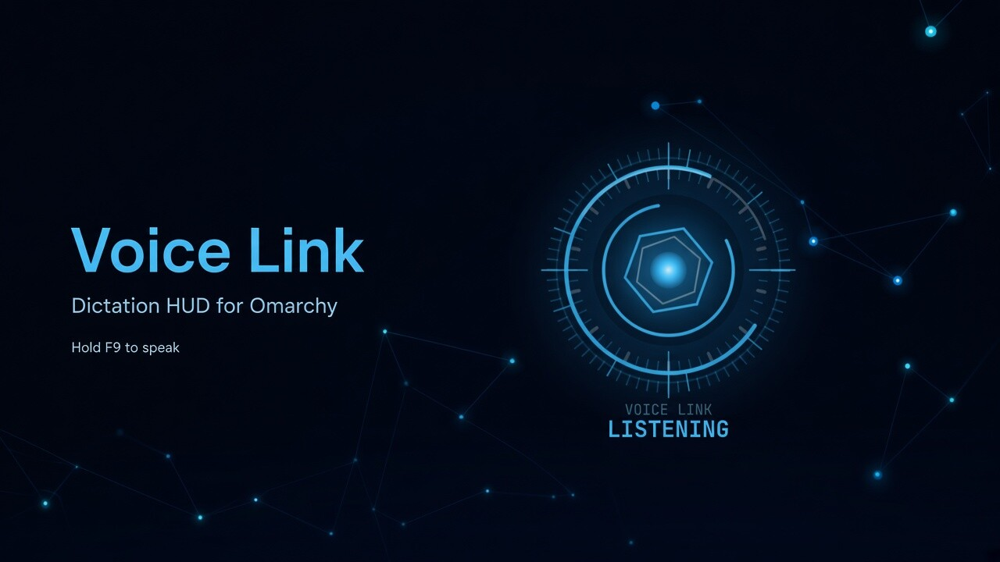
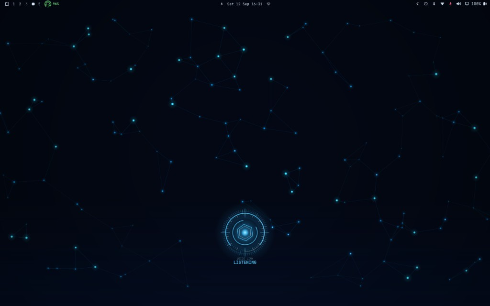
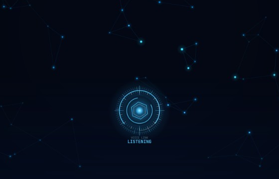
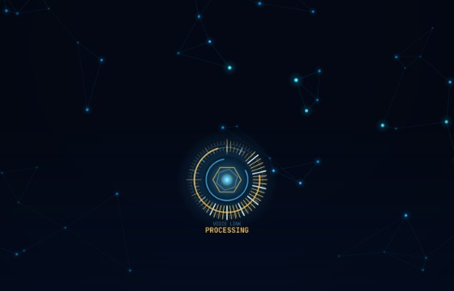
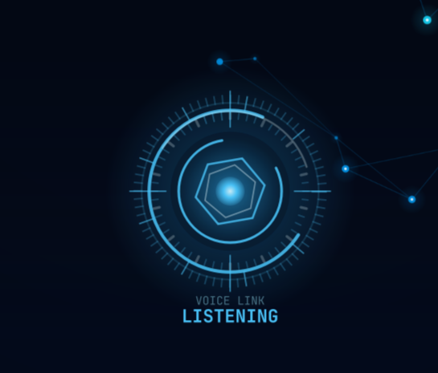

<p align="center">
  
</p>

A compact cyan assistant overlay for [Voxtype](https://voxtype.io/) on Omarchy.
Hold `F9` (or toggle `Super + Ctrl + X`) and a small HUD appears at the bottom of
the screen while dictation is active.

The overlay is a Voxtype Quickshell OSD package. It does not patch Omarchy or
the packaged Voxtype QML under `/usr/share`.

<p align="center">
  
</p>

## Preview

| Listening | Processing |
| --- | --- |
|  |  |

<p align="center">
  
</p>

Presentation extras in [`docs/`](docs/): `banner.jpg` for the README hero,
`social-banner.jpg` for GitHub/social previews, `icon.png` for avatars.

## What you get

- Compact cyan core and rotating rings while recording
- Voice-reactive crown around the reactor
- `LISTENING` while speaking, `PROCESSING` during transcription
- Click-through: the layer never steals pointer focus

## Install

Clone the repo, then point Voxtype at the package in `~/.config/voxtype/config.toml`:

```toml
[osd]
enabled = true
frontend = "quickshell"
style = "/path/to/VoxUiRestyle/osd-package"
palette = "package"
layout = "custom"
position = "bottom-center"
top_margin = 0.85
```

Then:

```bash
systemctl --user restart voxtype.service
```

`voxtype-audio-bridge` is already on PATH in the packaged Omarchy install, so a
separate `voxtype setup quickshell` is not required.

`position = "bottom-center"` keeps the HUD in the lower band, above docks and
the Omarchy OSD strip. Raise `top_margin` only if you switch away from a
bottom anchor.

## Restore the default OSD

Remove the `[osd]` block (or set `frontend = "gtk4"`), then restart
`voxtype.service`.
